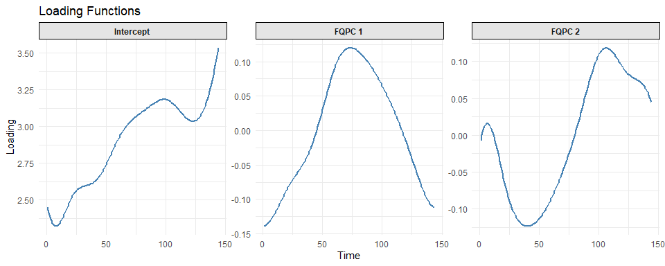
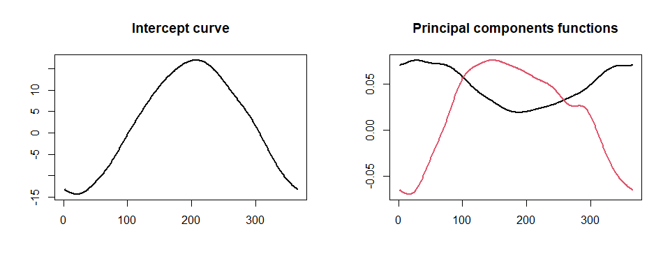
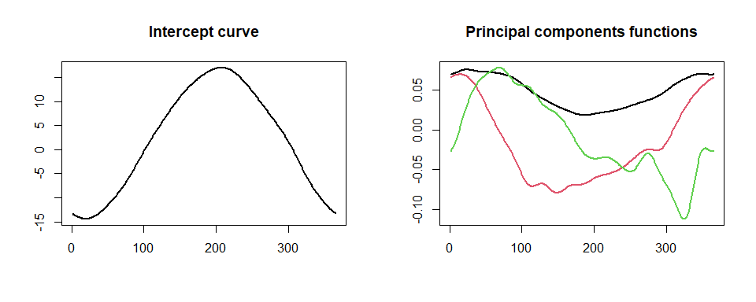
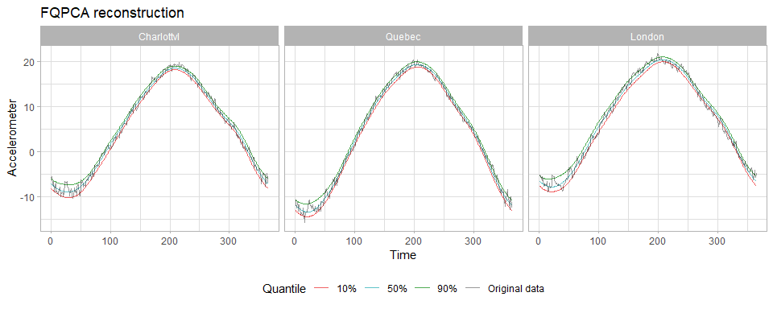

<!-- README.md is generated from README.Rmd. Please edit that file -->

# FunQ </a>

<!-- badges: start -->

[](https://www.gnu.org/licenses/gpl-3.0)
[](https://cran.r-project.org/package=yourPackageName)
[](https://www.tidyverse.org/lifecycle/)
<!-- badges: end -->

The goal of `FunQ` is to provide well-developed and documented
methodologies for working with functional data analysis from a quantile
perspective. Right now, the package implements functions solving the
functional quantile principal component analysis (fqpca) methodology.
FQPCA extends the concept of functional principal component analysis
(FPCA) to the quantile regression framework. The goal of many methods in
FDA is to recover the curve-specific mean by leveraging information
across time points, subjects, or both. Our goal is broader: we seek to
describe the full curve and time-specific probability distribution that
underlies individual measurements. Although only one draw from the
curve-and time-specific distribution of each individual is available, we
will leverage information across time points and curves to estimate
smooth, curve-specific quantile functions. This approach allows a richer
understanding of functional data than considering only the expected
value, and may be particularly useful when distributions are skewed,
vary across subjects or present outliers.

## Installation

You can install the development version of FunQ from
[GitHub](https://github.com/) with:

``` r
# install.packages("devtools")
devtools::install_github("alvaromc317/FunQ")
```

## Overview

`FunQ` provides functions for the implementation of the Functional
Quantile Principal Component Analysis methodology.

- This function can receive the functional data as an $(N\times T)$
  `matrix` (through parameter `Y`) or as a dataframe containing a column
  with a functional `tf` vector (through parameters `data` and
  `colname`).
- It can deal with irregular time grids, which means that can deal with
  missing data.
- Can control the level of smoothness of the results based on two
  approaches:
  - Based on the degrees of freedom of the spline basis reconstruction,
    using the parameter `splines.df` This is our preferred approach.
  - Based on the inclusion of a second derivative penalty on the splines
    coefficients, changing the `method` parameter to use a valid `CVXR`
    solver (for example, setting `method='SCS'`) and then selecting the
    desired hyper-parameter value (for example `alpha.ridge=1e-7`). This
    approach is experimental and is prone to show computational issues
    for large values of the hyper-parameter.

The package also implements functions to perform cross validation on
either the `splines.df` parameter (`cross_validation_df`) or the
`alpha.ridge` parameter (`cross_validation_alpha`). These cross
validation functions consider the quantile error as the reference
prediction error. This error metric is available using the function
`quantile_error`.

## Example 1: setting the basics

Lets us start by loading some libraries that will be used along this
example:

``` r
library(FunQ)
library(fda)
library(tidyverse)
```

``` r
# We use the tidy structure of the tidyfun package to deal with the functional data
devtools::install_github("tidyfun/tidyfun")
```

``` r
library(tidyfun)
```

`fqpca` is designed to deal with functional data. The following example
generates a fake dataset with 200 observations taken every 10 minutes
during one day. This defines a data matrix with 200 rows and 144 columns
following the formula:

$$x_i = \lambda_1(sin(t)+sin(0.5t))+\varepsilon_i$$ where

- $\lambda_1\sim N(0,0.4)$
- $\varepsilon_i\sim\chi^2(3)$

``` r
set.seed(5)

n = 200
t = 144
time.points = seq(0, 2*pi, length.out=t)
Y = matrix(rep(sin(time.points) + sin(0.5*time.points), n), byrow=TRUE, nrow=n)
Y = Y + matrix(rnorm(n*t, 0, 0.4), nrow=n) + rchisq(n, 3)

Y[1:50,] %>% tf::tfd() %>% plot(alpha=0.2)
```


The above plot visualizes a subset of the data generated this way. Since
the fqpca methodology can deal with sparse and irregular time
measurements, we will include 50% of missing observations in the data
matrix.

``` r
Y[sample(n*t, as.integer(0.50*n*t))] = NA
```

Now, we apply the `fqpca` methodology on this dataset and obtain the
decomposition of the data in terms of the median (`quantile.value=0.5`),
which is a robust alternative to the mean based predictions of
traditional FPCA.

### The `fqpca` function

``` r
Y.train = Y[1:150,]
Y.test = Y[151:n,]

results = fqpca(Y=Y.train, npc=2, quantile.value=0.5)

loadings = results$loadings
scores = results$scores

# Recover x_train based on decomposition
Y.train.estimated = fitted(results, pve = 0.95)
```

Finally, given a new set of observations, it is possible to decompose
the new observations using the loadings already computed.

``` r
scores.test = predict(results, newdata=Y.test)
Y.test.estimated = scores.test %*% t(loadings)
```

You can plot the computed loadings on a somewhat not very pretty plot,
but still useful plot

``` r
plot(results, pve=0.95)
```



And you can also compute the quantile error between the curve
reconstruction and the true data, which is the metric we recommend to
use as prediction error metric. Observe that the metric is dependent on
the quantile of interest, which should be adjusted accordingly.

``` r
quantile_error(Y=Y.train, Y.pred=Y.train.estimated, quantile.value=0.5)
#> [1] 0.1597831
```

### Cross validating

The `FunQ` package implements functions that allow to perform cross
validation based on both the `splines.df` or the `alpha.ridge`
criterias.

``` r
splines.df.grid = c(5, 10, 15, 20)
cv_result = cross_validation_df(Y, splines.df.grid=splines.df.grid, n.folds=3, verbose.cv=F)
cv_result$error.matrix
#>           [,1]      [,2]      [,3]
#> [1,] 0.1625077 0.1671439 0.1682230
#> [2,] 0.1626262 0.1690548 0.1681896
#> [3,] 0.1649486 0.1689905 0.1683290
#> [4,] 0.1640411 0.1688536 0.1686171
```

The dimensions of the error matrix are
`(length(splines.df.grid), n.folds)`. We can find the optimal number of
degrees of freedom by taking the mean of each row and picking the
minimum.

``` r
optimal_df = which.min(rowMeans(cv_result$error.matrix))
paste0('Optimal number of degrees of freedom: ', splines.df.grid[optimal_df])
#> [1] "Optimal number of degrees of freedom: 5"
```

The package also includes a function that allows to perform cross
validation on the hyper-parameter controlling the effect of a second
derivative penalty on the splines. Be aware that this smoothness
controlling process is experimental and may be subject to computation
issues.

``` r
cv_result = cross_validation_alpha(Y, alpha.grid=c(0, 1e-10, 1e-5), n.folds=2, verbose.cv=F)
cv_result$error.matrix
#>           [,1]      [,2]
#> [1,] 0.1678275 0.1685404
#> [2,] 0.1678590 0.1685542
#> [3,] 0.1731737 0.1734196
```

The dimensions of the error matrix are `(length(alpha.grid), n.folds)`.

## Example 2: The Canadian Weather dataset

Let’s see an example using the well known weather dataset. The `FQPCA`
package can work with:

- data matrices (as shown above, using the parameter `Y` when calling
  the function)
- Tidyfun `tf` vectors (using the parameter `Y` when calling the
  function)
- Dataframes containing tidyfun vectors (using the `data` and `colname`
  additional parameters)

Let us load and visualize the data.

``` r
matrix.data = t(fda::CanadianWeather$dailyAv[,,1])
data = tibble(temperature = tf::tfd(matrix.data, arg = 1:365),
              province = CanadianWeather$province)
head(data)
#> # A tibble: 6 × 2
#>                      temperature province     
#>                        <tfd_reg> <chr>        
#> 1 [1]: (1,-4);(2,-3);(3,-3); ... Newfoundland 
#> 2 [2]: (1,-4);(2,-4);(3,-5); ... Nova Scotia  
#> 3 [3]: (1,-4);(2,-4);(3,-5); ... Nova Scotia  
#> 4 [4]: (1,-1);(2,-2);(3,-2); ... Nova Scotia  
#> 5 [5]: (1,-6);(2,-6);(3,-7); ... Ontario      
#> 6 [6]: (1,-8);(2,-8);(3,-9); ... New Brunswick
```

``` r
data %>% 
  ggplot(aes(y=temperature, color=province)) + 
  geom_spaghetti() + 
  theme_light()
```



Now we perform cross validation on the degrees of freedom and find the
optimal value.

``` r
splines.df.grid = c(5, 10, 15, 20)
cv_result = cross_validation_df(data=data, colname='temperature', splines.df.grid=splines.df.grid, n.folds=3, verbose.cv=F)
optimal_df = splines.df.grid[which.min(rowMeans(cv_result$error.matrix))]
paste0('Optimal number of degrees of freedom: ', optimal_df)
#> [1] "Optimal number of degrees of freedom: 20"
```

We can build the final model using the optimal number of degrees of
freedom, and check the number of components based on the percentage of
explained variability.

``` r
results = fqpca(Y=data$temperature, npc=10, quantile.value=0.5, splines.df=optimal_df, seed=5)
cumsum(results$pve)
#>  [1] 0.8872604 0.9721988 0.9917052 0.9969639 0.9981614 0.9990531 0.9995422
#>  [8] 0.9997888 0.9999272 1.0000000
```

This shows that with 3 components we are able to explain 99.1% of the
variability in the data. Lets see these components.

``` r
plot(results, pve = 0.99)
```



### Computing various quantile levels

One great benefit of `fqpca` is the possibility to obtain the
distribution of the data at different quantile levels, effectively
treating each observation as a draw from it’s own distribution that we
are now able to recover. We can do this by running `fqpca` at different
quantile levels, say 10%, 50% and 90%.

``` r
m01 = fqpca(Y=data$temperature, npc=10, quantile.value=0.1, splines.df=15, seed=5)
m05 = fqpca(Y=data$temperature, npc=10, quantile.value=0.5, splines.df=15, seed=5)
m09 = fqpca(Y=data$temperature, npc=10, quantile.value=0.9, splines.df=15, seed=5)

Y01 = fitted(m01, pve = 0.99)
Y05 = fitted(m05, pve = 0.99)
Y09 = fitted(m09, pve = 0.99)
```

Now given an observation we can visualize it’s quantile curves along
with the raw data


