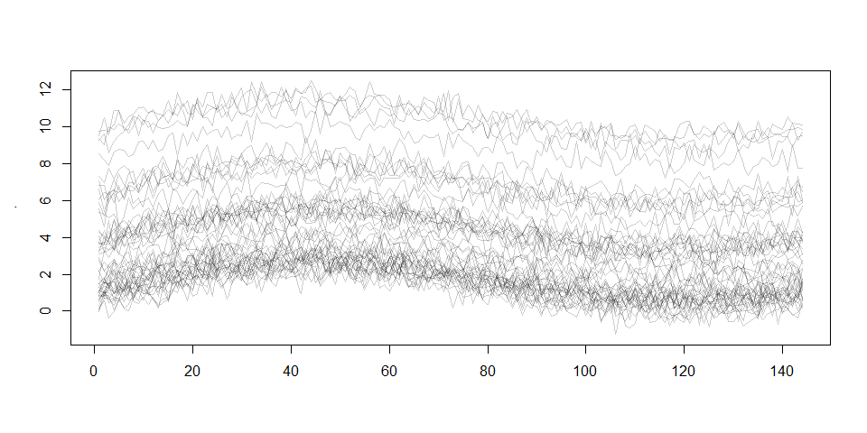

<!-- README.md is generated from README.Rmd. Please edit that file -->

# `FunQuantPCA` package

<!-- badges: start -->

[](https://www.gnu.org/licenses/gpl-3.0)
[](https://cran.r-project.org/package=yourPackageName)
[](https://www.tidyverse.org/lifecycle/)
<!-- badges: end -->

`FunQuantPCA` is an R package that solves the functional quantile
principal component analysis (fqpca) methodology. FQPCA extends the
concept of functional principal component analysis (FPCA) to the
quantile regression framework. The goal of many methods in FDA is to
recover the curve-specific mean by leveraging information across time
points, subjects, or both. Our goal is broader: we seek to describe the
full curve and time-specific probability distribution that underlies
individual measurements. Although only one draw from the curve-and
time-specific distribution of each individual is available, we will
leverage information across time points and curves to estimate smooth,
curve-specific quantile functions. This approach allows a richer
understanding of functional data than considering only the expected
value, and may be particularly useful when distributions are skewed,
vary across subjects or present outliers.

## Installation

You can install the development version of FunQuantPCA from
[GitHub](https://github.com/) with:

``` r
# install.packages("devtools")
devtools::install_github("alvaromc317/FunQuantPCA")
```

## Example

`fqpca` is mainly designed to deal with functional data. The following
example generates a fake dataset with 200 observations taken every 10
minutes during one day. This defines a data matrix with 200 rows and 144
columns following the formula:

$$x_i = \lambda_1(sin(t)+sin(0.5t))+\varepsilon_i$$ where \*
$\lambda_1\sim N(0,0.4)$ \* $\varepsilon_i\sim\chi^2(3)$

``` r
n = 200
t = 144
time.points = seq(0, 2*pi, length.out=t)
x = matrix(rep(sin(time.points) + sin(0.5*time.points), n), byrow=TRUE, nrow=n)
x = x + matrix(rnorm(n*t, 0, 0.4), nrow=n) + rchisq(n, 3)
matplot(t(x[1:20,]), type="l")
```


The above plot visualizes a subset of the data generated this way. Since
the main methodology in the package can deal with sparse and irregular
time measurements, we will include 75% of missing observations in the
data matrix.

``` r
x[sample(n*t, as.integer(0.75*n*t))] = NA
```

Now, we apply the `fqpca` methodology on this dataset and obtain the
decomposition of the data in terms of the median (`quantile.value=0.5`),
which is a robust alternative to the mean based predictions of
traditional FPCA.

``` r
library(FunQuantPCA)
x_train = x[1:150,]
x_test = x[151:n,]
results = fqpca(x=x_train, n_components=2, quantile_value=0.5)

loadings = results$loadings
scores = results$scores

# Recover x_train based on decomposition
x_train_estimated = scores %*% t(loadings)
```

Finally, given a new set of observations, it is possible to decompose
the new observations using the loadings already computed.

``` r
scores_test = predict(results, newdata=x_test)
x_test_estimated = scores_test %*% t(loadings)
```

You can plot the computed loadings on a somewhat not very pretty plot,
but still useful

``` r
plot(results)
```



And you can also compute the quantile error between the curve
reconstruction and the true data

``` r
quantile_error(x=x_train, x_pred=x_train_estimated, quantile_value=0.5)
#> [1] 0.1531883
```
