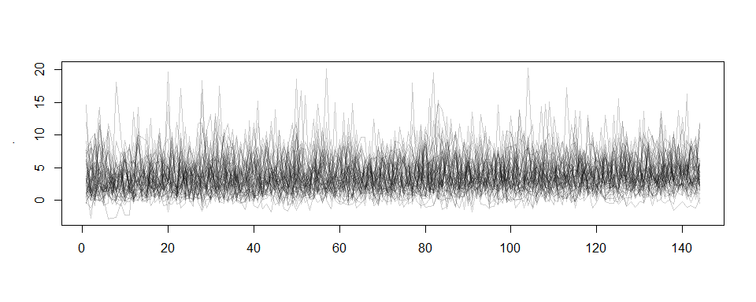
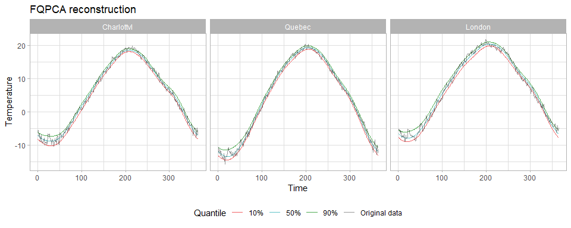

<!-- README.md is generated from README.Rmd. Please edit that file -->

# FunQ </a>

<!-- badges: start -->

[](https://www.gnu.org/licenses/gpl-3.0)
[](https://cran.r-project.org/package=yourPackageName)
[](https://www.tidyverse.org/lifecycle/)
<!-- badges: end -->

`FunQ` is an R package that provides methodologies for functional data
analysis from a quantile regression perspective. It currently implements
the Functional Quantile Principal Component Analysis (FQPCA) methodology
explained in detail in [this
paper](https://doi.org/10.1093/biostatistics/kxae040), which extends
traditional Functional Principal Component Analysis (FPCA) to the
quantile regression framework. This allows for a richer understanding of
functional data by capturing the full curve and time-specific
probability distributions underlying individual measurements, especially
useful when data distributions are skewed, vary across subjects, or
contain outliers.

## Installation

You can install the development version of FunQ from
[GitHub](https://github.com/) with:

``` r
# install.packages("devtools")
devtools::install_github("alvaromc317/FunQ")
```

## Overview

`FunQ` provides functions for implementing the Functional Quantile
Principal Component Analysis methodology. Key features include:

- Flexible Input Formats: Accepts functional data as an $(N\timesT)$
  matrix, a `tf` functional vector, or a `dataframe` containing a column
  with a `tf` functional vector (using the `data` and `colname`
  parameters).
- Handling Missing Data: Capable of dealing with irregular time grids
  and missing data.
- Smoothness Control: Allows control over the smoothness of the results
  using two approaches:
  - Spline Degrees of Freedom: Using the `splines.df` parameter to set
    the degrees of freedom in spline basis reconstruction.
  - Second Derivative Penalty: Experimental method involving a second
    derivative penalty on the spline coefficients by setting
    `penalized = TRUE` and specifying `lambda.ridge`. Requires setting
    `method = "conquer"`.

Additionally, the package includes functions for cross-validation of
parameters such as `splines.df` (`cross_validation_df`) and
`lambda.ridge` (`cross_validation_lambda`), using the quantile error as
the reference prediction error metric (`quantile_error` function).

## Example 1: basics of `fqpca`

Let’s start by loading the necessary libraries:

``` r
# We use the tidy structure of the tidyfun package to deal with the functional data
devtools::install_github("tidyfun/tidyfun")
```

``` r
library(FunQ)
library(fda)
library(tidyverse)
library(tidyfun)
```

We use the `tidyfun` package for handling functional data structures.

### Generating synthetic data

We generate a synthetic dataset with 200 observations taken every 10
minutes over a day (144 time points). The data follows the formula:

$$x_i = c_{i1}(\text{sin}(t)+\text{sin}(0.5t))+\varepsilon_i$$

where

- $c_1\sim N(0,0.4)$
- $\varepsilon_i\sim\chi^2(3)$

``` r
set.seed(5)

n = 200
t = 144
time.points = seq(0, 2*pi, length.out=t)
Y = matrix(rep(sin(time.points) + sin(0.5*time.points), n), byrow=TRUE, nrow=n)
Y = Y + matrix(rnorm(n*t, 0, 0.4), nrow=n) + rchisq(n, 3)

Y[1:50,] %>% tf::tfd() %>% plot(alpha=0.2)
```



The above plot visualizes a subset of the data generated this way. To
simulate missing data and test the method’s robustness, we introduce 50%
missing observations:

``` r
Y[sample(n*t, as.integer(0.50*n*t))] = NA
```

### Aplying `fqpca`

We split the data into training and testing sets:

``` r
Y.train = Y[1:150,]
Y.test = Y[151:n,]
```

We then apply the `fqpca` function to decompose the data in terms of the
median (`quantile.value = 0.5`), providing a robust alternative to
mean-based predictions:

``` r
results = fqpca(data=Y.train, npc=2, quantile.value=0.5)

loadings = results$loadings
scores = results$scores

# Recover x_train based on decomposition
Y.train.estimated = fitted(results, pve = 0.95)
```

For new observations, we can compute scores using the existing loadings:

``` r
scores.test = predict(results, newdata=Y.test)
Y.test.estimated = scores.test %*% t(loadings)
```

Plotting the computed loadings:

``` r
plot(results, pve=0.95)
```


Calculating the quantile error between the reconstructed and true data:

``` r
quantile_error(Y=Y.train, Y.pred=Y.train.estimated, quantile.value=0.5)
#> [1] 0.1597332
```

### Cross validation

We perform cross-validation to optimize the `splines.df` parameter:

``` r
splines.df.grid = c(5, 10, 15, 20)
cv_result = cross_validation_df(Y, splines.df.grid=splines.df.grid, n.folds=3, verbose.cv=F)
cv_result$error.matrix
#>         Fold 1    Fold 2    Fold 3
#> [1,] 0.1623378 0.1685013 0.1676664
#> [2,] 0.1630681 0.1683739 0.1680962
#> [3,] 0.1644931 0.1689397 0.1683112
#> [4,] 0.1641285 0.1694750 0.1683882
```

The dimensions of the error matrix are
`(length(splines.df.grid), n.folds)`. We can determine the optimal
degrees of freedom by taking the mean of each row and picking the
minimum.

``` r
optimal_df = which.min(rowMeans(cv_result$error.matrix))
paste0('Optimal number of degrees of freedom: ', splines.df.grid[optimal_df])
#> [1] "Optimal number of degrees of freedom: 5"
```

## Example 2: Using penalized `fqpca`

n this example, we demonstrate how to apply the second derivative
penalty approach by setting penalized = TRUE and lambda.ridge = 0.001.
This method is experimental but has shown promising results.

``` r
# Apply fqpca with penalization
results_penalized <- fqpca(data = Y.train, npc = 2, quantile.value = 0.5, penalized = TRUE, lambda.ridge = 0.001, method = "conquer")

# Reconstruct the training data
Y.train.estimated_penalized <- fitted(results_penalized, pve = 0.95)
```

The package also includes a function that allows to perform cross
validation on the hyper-parameter controlling the effect of a second
derivative penalty on the splines. Be aware that this smoothness
controlling process is experimental.

``` r
cv_result = cross_validation_lambda(Y, lambda.grid=c(0, 1e-5, 1e-3), n.folds=3, verbose.cv=F)
cv_result$error.matrix
#>         Fold 1    Fold 2    Fold 3
#> [1,] 0.1686230 0.1659071 0.1675024
#> [2,] 0.1696019 0.1673563 0.1691598
#> [3,] 0.1694931 0.1680963 0.1686873
```

The dimensions of the error matrix are `(length(lambda.grid), n.folds)`.

## Example 3: The Canadian Weather dataset

Let’s explore the use of `FunQ` with the well-known Canadian Weather
dataset. `FunQ` can handle:

- Data matrices
- `tf` vectors from the `tidyfun` package
- `data.frames` containing `tf` vectors

### Loading and Visualizing Data

``` r
matrix.data = t(fda::CanadianWeather$dailyAv[,,1])
data = tibble(temperature = tf::tfd(matrix.data, arg = 1:365),
              province = CanadianWeather$province)
head(data)
#> # A tibble: 6 × 2
#>                      temperature province     
#>                        <tfd_reg> <chr>        
#> 1 [1]: (1,-4);(2,-3);(3,-3); ... Newfoundland 
#> 2 [2]: (1,-4);(2,-4);(3,-5); ... Nova Scotia  
#> 3 [3]: (1,-4);(2,-4);(3,-5); ... Nova Scotia  
#> 4 [4]: (1,-1);(2,-2);(3,-2); ... Nova Scotia  
#> 5 [5]: (1,-6);(2,-6);(3,-7); ... Ontario      
#> 6 [6]: (1,-8);(2,-8);(3,-9); ... New Brunswick
```

Plotting the temperature data:

``` r
data %>% 
  ggplot(aes(y=temperature, color=province)) + 
  geom_spaghetti() + 
  theme_light()
```


### Cross-Validation for `splines.df`

We perform cross-validation to find the optimal `splines.df` value:

``` r
splines.df.grid = c(5, 10, 15, 20)
cv_result = cross_validation_df(data=data, colname='temperature', splines.df.grid=splines.df.grid, n.folds=3, verbose.cv=F)
optimal_df = splines.df.grid[which.min(rowMeans(cv_result$error.matrix))]
paste0('Optimal number of degrees of freedom: ', optimal_df)
#> [1] "Optimal number of degrees of freedom: 20"
```

### Building the Final Model

Using the optimal `splines.df`, we fit the fqpca model and examine the
explained variance:

``` r
results = fqpca(data=data$temperature, npc=10, quantile.value=0.5, splines.df=optimal_df, seed=5)
cumsum(results$pve)
#>  [1] 0.8869980 0.9723360 0.9918146 0.9970347 0.9981933 0.9990281 0.9995235
#>  [8] 0.9997616 0.9999040 1.0000000
```

With 3 components, we achieve over 99% of explained variability.
Plotting the components:

``` r
plot(results, pve = 0.99)
```


### Computing various quantile levels

One of the advantages of `FunQ` is its ability to recover the
distribution of data at different quantile levels. We can compute the
10%, 50%, and 90% quantile curves:

``` r
m01 = fqpca(data=data$temperature, npc=10, quantile.value=0.1, splines.df=15, seed=5)
m05 = fqpca(data=data$temperature, npc=10, quantile.value=0.5, splines.df=15, seed=5)
m09 = fqpca(data=data$temperature, npc=10, quantile.value=0.9, splines.df=15, seed=5)

Y01 = fitted(m01, pve = 0.99)
Y05 = fitted(m05, pve = 0.99)
Y09 = fitted(m09, pve = 0.99)
```

Now given an observation we can visualize it’s quantile curves along
with the raw data


