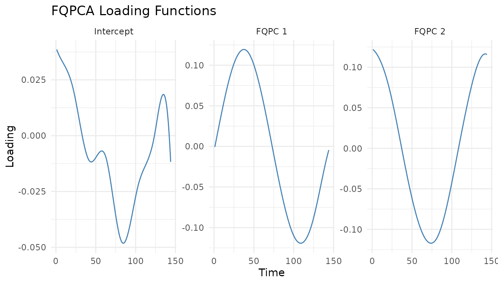

# Getting Started with FQPCA

Functional Quantile Principal Component Analysis (FQPCA) is a
methodology designed to work with functional data from a quantile
perspective. It extends traditional Functional Principal Component
Analysis (FPCA) to the quantile regression framework, allowing for a
richer understanding of functional data by capturing full curve and
time-specific probability distributions.

This guide provides a walk-through on how to use FQPCA inside the `FunQ`
package, covering:

1.  Model fitting and prediction.
2.  Smoothness control (unpenalized vs. penalized).
3.  Selecting the number of components.
4.  Parameter tuning using Cross-Validation.

Let’s load the required packages:

``` r

library(FunQ)
library(ggplot2)
```

## 1. Core Model Fitting

We begin by generating some synthetic functional data containing missing
values.

``` r

set.seed(5)

n.obs <- 150
n.time <- 144
Y.axis <- seq(0, 2*pi, length.out = n.time)

# Define PC functions
pc1 <- sin(Y.axis)
pc2 <- cos(Y.axis)

# Generate individual score coefficients
c1.vals <- rnorm(n.obs, mean=0, sd=1)
c2.vals <- rnorm(n.obs, mean=0, sd=0.8)

# Construct functional data matrix
Y <- c1.vals %*% t(pc1) + c2.vals %*% t(pc2)

# Add noise and some random missing observations (20%)
Y <- Y + matrix(rnorm(n.obs * n.time, mean=0, sd=0.4), nrow = n.obs)
Y[sample(n.obs * n.time, as.integer(0.2 * n.obs * n.time))] <- NA
```

We fit an FQPCA model at the median ($`q = 0.5`$) with 2 components:

``` r

# Fit FQPCA model
model_fqpca <- fqpca(
  data = Y,
  npc = 2,
  quantile.value = 0.5,
  periodic = FALSE,
  splines.df = 10,
  seed = 5,
  verbose = FALSE
)

# Access model components
intercept <- model_fqpca$intercept
loadings <- model_fqpca$loadings
scores <- model_fqpca$scores
```

### Fitted Values and Predictions

To reconstruct the curves or compute fitted values, use the S3 method
[`fitted()`](https://rdrr.io/r/stats/fitted.values.html):

``` r

# Reconstruct training curves using all components
Y.fitted <- fitted(model_fqpca)

# Reconstruct curves to achieve 95% proportion of variance explained (PVE)
Y.fitted.95 <- fitted(model_fqpca, pve = 0.95)
```

To predict score coordinates for new unseen curves, use
[`predict()`](https://rdrr.io/r/stats/predict.html):

``` r

# Generate new data
Y.new <- Y[1:10, ]

# Predict scores for new data
new_scores <- predict(model_fqpca, newdata = Y.new)
```

------------------------------------------------------------------------

## 2. Smoothness Control

The package provides two methods to control the smoothness of the
estimated loading functions:

1.  **Spline Degrees of Freedom**: Set directly using the `splines.df`
    argument.
2.  **Second Derivative Penalty (Experimental)**: Set `penalized = TRUE`
    and supply a positive `lambda.ridge` value. This is solved using the
    `conquer` package.

``` r

# Fit using a second-derivative ridge penalty
model_penalized <- fqpca(
  data = Y,
  npc = 2,
  quantile.value = 0.5,
  penalized = TRUE,
  lambda.ridge = 1e-4,
  splines.method = "conquer",
  periodic = FALSE,
  seed = 5
)
```

------------------------------------------------------------------------

## 3. Selecting Components via Explained Variability

We can compute the percentage of explained variability (PVE) for each
component.

``` r

# View PVE per component
model_fqpca$pve
#> [1] 0.6233829 0.3766171

# View cumulative PVE
cumsum(model_fqpca$pve)
#> [1] 0.6233829 1.0000000
```

Visualizing the loading functions using the package’s generic `plot`
method:

``` r

# Plot loadings for components explaining up to 99% variance
plot(model_fqpca, pve = 0.99) + 
  theme_minimal() + 
  ggtitle("FQPCA Loading Functions")
```



------------------------------------------------------------------------

## 4. Parameter Tuning (Cross-Validation)

We can tune the degrees of freedom (`splines.df`) or the penalty
hyperparameter (`lambda.ridge`) using k-fold cross-validation.

### Cross-Validation of Splines Degrees of Freedom

We can evaluate a grid of `splines.df` values and measure prediction
error using
[`quantile_error()`](https://alvaromc317.github.io/FunQ/reference/quantile_error.md):

``` r

df_grid <- c(5, 8, 12)

# Run CV for df
cv_df <- fqpca_cv_df(
  data = Y,
  splines.df.grid = df_grid,
  n.folds = 3,
  criteria = "points",
  periodic = FALSE,
  seed = 5,
  verbose.cv = FALSE
)

# Mean error matrix
cv_df$error.matrix
#>         Fold 1    Fold 2    Fold 3
#> [1,] 0.1666141 0.1656331 0.1665625
#> [2,] 0.1645947 0.1633414 0.1639917
#> [3,] 0.1647238 0.1634190 0.1640008

# Find the best df
optimal_df <- df_grid[which.min(rowMeans(cv_df$error.matrix))]
message("Optimal Degrees of Freedom: ", optimal_df)
#> Optimal Degrees of Freedom: 8
```

### Cross-Validation of Penalization parameter Lambda

Similarly, when using penalized splines, we can evaluate a grid of ridge
penalty parameters:

``` r

lambda_grid <- c(0, 1e-5, 1e-3)

# Run CV for lambda
cv_lambda <- fqpca_cv_lambda(
  data = Y,
  lambda.grid = lambda_grid,
  n.folds = 3,
  criteria = "points",
  periodic = FALSE,
  seed = 5,
  verbose.cv = FALSE
)

# Error matrix
cv_lambda$error.matrix
#>         Fold 1    Fold 2    Fold 3
#> [1,] 0.1646853 0.1633307 0.1639331
#> [2,] 0.1646761 0.1633252 0.1639382
#> [3,] 0.1646907 0.1633282 0.1639317

# Find the best lambda
optimal_lambda <- lambda_grid[which.min(rowMeans(cv_lambda$error.matrix))]
message("Optimal Lambda: ", optimal_lambda)
#> Optimal Lambda: 1e-05
```

------------------------------------------------------------------------

## References

- Álvaro Méndez-Civieta, Ying Wei, Keith M Diaz, Jeff Goldsmith. (2025).
  **Functional quantile principal component analysis**. *Biostatistics*,
  26(1), kxae040. DOI:
  [10.1093/biostatistics/kxae040](https://doi.org/10.1093/biostatistics/kxae040)
