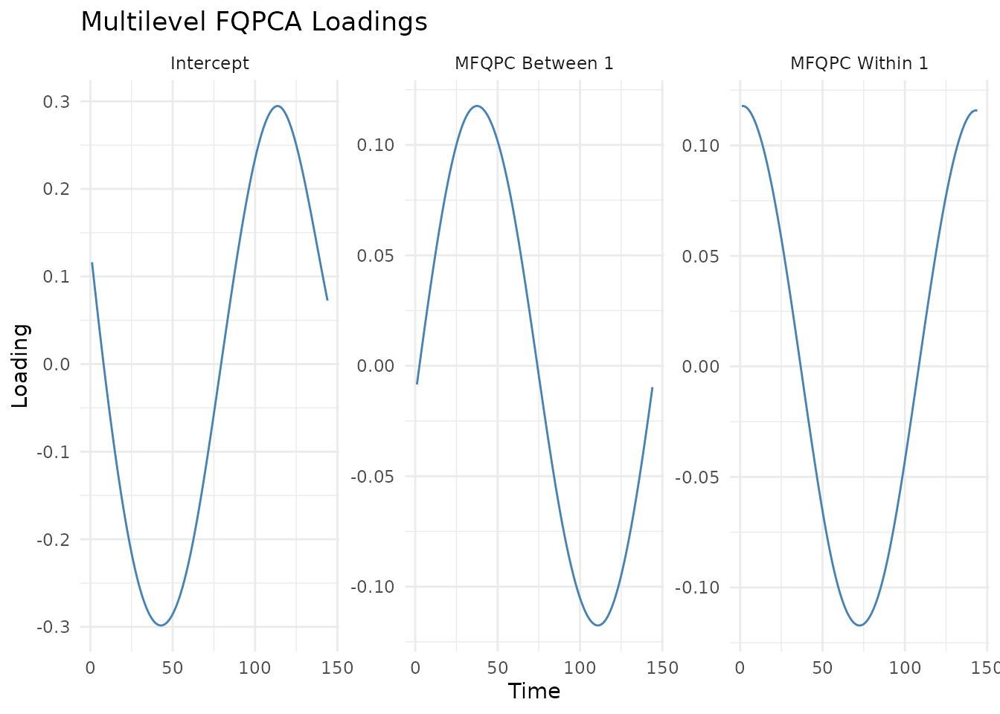

# Multilevel Analysis with MFQPCA

Multilevel Functional Quantile Principal Component Analysis (MFQPCA) is
designed to handle functional data with a hierarchical or
repeated-measures structure (e.g. multiple days of activity tracking
curves collected per subject).

MFQPCA decomposes the functional variation into two distinct levels:

1.  **Between-subject level**: Captures differences between subjects
    (average subject-specific behavior).
2.  **Within-subject level**: Captures day-to-day or
    measurement-to-measurement variation within the same subject.

This vignette covers how to fit models, predict new scores, plot
results, and tune hyperparameters using the `FunQ` package.

Let’s load the required packages:

``` r

library(FunQ)
library(ggplot2)
```

------------------------------------------------------------------------

## 1. Generating Multilevel Synthetic Data

We generate a repeated-measures dataset where $`N = 200`$ curves are
collected from $`I = 20`$ individuals (10 repeated measurements per
individual).

``` r

set.seed(5)

n.individuals <- 20
n.repeated <- 10
n.time <- 144
N <- n.repeated * n.individuals

group <- rep(seq_len(n.individuals), each = n.repeated)
Y.axis <- seq(0, 2*pi, length.out = n.time)

# Define between-subject and within-subject PCs
pc.between <- sin(Y.axis)
pc.within <- cos(Y.axis)

# Generate scores
scores.between <- rnorm(n.individuals)
scores.between.full <- scores.between[match(group, unique(group))]
scores.within <- rnorm(N)

# Construct data
Y <- scores.between.full %*% t(pc.between) + scores.within %*% t(pc.within)

# Add noise and some random missing observations
Y <- Y + matrix(rnorm(N * n.time, mean=0, sd=0.3), nrow = N)
Y[sample(N * n.time, as.integer(0.2 * N * n.time))] <- NA
```

------------------------------------------------------------------------

## 2. Model Fitting

We apply
[`mfqpca()`](https://alvaromc317.github.io/FunQ/reference/mfqpca.md) at
the median ($`q = 0.5`$) with 1 between-subject component and 1
within-subject component:

``` r

# Fit Multilevel FQPCA
model_mfqpca <- mfqpca(
  data = Y,
  group = group,
  npc.between = 1,
  npc.within = 1,
  quantile.value = 0.5,
  periodic = FALSE,
  splines.df = 8,
  seed = 5,
  verbose = FALSE
)

# Access components
intercept <- model_mfqpca$intercept
loadings_between <- model_mfqpca$loadings.between
loadings_within <- model_mfqpca$loadings.within
scores_between <- model_mfqpca$scores.between
scores_within <- model_mfqpca$scores.within
```

### Fitted Values and Predictions

To reconstruct curves using the multilevel components, use the generic
[`fitted()`](https://rdrr.io/r/stats/fitted.values.html) method:

``` r

# Reconstruct all curves
Y.fitted <- fitted(model_mfqpca)
```

To predict score components for new subjects, we use
[`predict()`](https://rdrr.io/r/stats/predict.html). When predicting for
new subjects, we need to supply the new group membership and their
functional data:

``` r

# Create dummy new subject with 5 repeated measurements
Y.new <- Y[1:5, ]
new_group <- rep("new_subject_1", 5)

# Predict multilevel scores
new_scores <- predict(
  model_mfqpca,
  newdata = Y.new,
  newdata.group = new_group
)

# New predicted scores
new_scores$scores.between
#>           [,1]
#> [1,] -4.838801
head(new_scores$scores.within)
#>           [,1]
#> [1,]  6.751913
#> [2,]  6.698069
#> [3,] 11.309779
#> [4,]  5.003713
#> [5,]  6.128155
```

------------------------------------------------------------------------

## 3. Visualizing Between and Within Loadings

You can visualize both the between-subject and within-subject loading
functions using the generic
[`plot()`](https://rdrr.io/r/graphics/plot.default.html) method:

``` r

# Plot loading functions
plot(model_mfqpca) + 
  theme_minimal() + 
  ggtitle("Multilevel FQPCA Loadings")
```



------------------------------------------------------------------------

## 4. Tuning `splines.df` (Cross-Validation)

We can optimize the degrees of freedom parameter (`splines.df`) using
k-fold cross-validation specifically adapted for multilevel structures.

``` r

df_grid <- c(5, 8, 10)

# Run CV for multilevel degrees of freedom
cv_mfqpca <- mfqpca_cv_df(
  data = Y,
  group = group,
  splines.df.grid = df_grid,
  npc.between = 1,
  npc.within = 1,
  n.folds = 2,
  criteria = "points",
  periodic = FALSE,
  seed = 5,
  verbose.cv = FALSE
)

# Error matrix
cv_mfqpca$error.matrix
#>         Fold 1    Fold 2
#> [1,] 0.1259078 0.1264731
#> [2,] 0.1236930 0.1238107
#> [3,] 0.1239126 0.1240724

# Find the best df
optimal_df <- df_grid[which.min(rowMeans(cv_mfqpca$error.matrix))]
message("Optimal Multilevel Degrees of Freedom: ", optimal_df)
#> Optimal Multilevel Degrees of Freedom: 8
```

------------------------------------------------------------------------

## References

- Álvaro Méndez-Civieta, Ying Wei, Jeff Goldsmith. (2026). **Multilevel
  functional quantile principal component analysis**. *Biostatistics*,
  kxag017. DOI:
  [10.1093/biostatistics/kxag017](https://doi.org/10.1093/biostatistics/kxag017)
